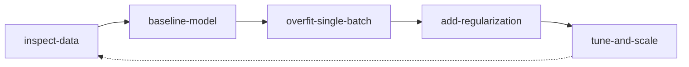

# 🔄 Karpathy Workflow Chain

## Commands

| Step | Command                 | Purpose                     |
| ---- | ----------------------- | --------------------------- |
| 1    | `/inspect-data`         | Understand your data deeply |
| 2    | `/baseline-model`       | Establish a dumb baseline   |
| 3    | `/overfit-single-batch` | Prove the model CAN learn   |
| 4    | `/add-regularization`   | Prevent overfitting         |
| 5    | `/tune-and-scale`       | Scale up safely             |

## Core Principles (Karpathy)

1. **Become one with the data** - Never trust abstractions.
2. **Start stupid** - The baseline must be embarrassingly simple.
3. **Overfit first** - If it can't memorize, it can't generalize.
4. **Regularize second** - Add complexity only when needed.
5. **Scale last** - Never scale broken systems.
