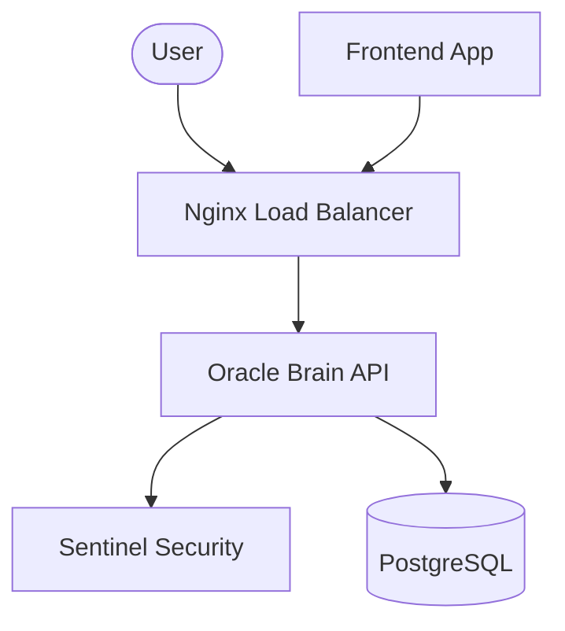

<div align="center">


# 🌌 ANTIGRAVITY

**Breaking the laws of traditional infrastructure with AI-driven intelligence.**

[](https://github.com/Neiland85/antigravity-project/actions)
[](https://www.python.org/)
[](https://fastapi.tiangolo.com/)
[](https://www.docker.com/)
[](LICENSE)

---

[Explore Docs](/docs) • [View Architecture](#-architecture) • [Getting Started](#-getting-started) • [Security](#-sentinel-security)

</div>

## ✨ Introduction

**Antigravity** is a distributed, AI-powered ecosystem designed for high-performance service orchestration. It leverages the **Oracle Brain** (a sub-quantum processing unit powered by Gemini AI) and **Sentinel** (a hyper-reactive security mesh) to provide a seamless, secure, and scalable experience.

## 🏗️ Architecture

The project is built on a distributed micro-service architecture:

-   **🧠 Oracle Brain (Backend)**: The core intelligence module built with FastAPI. It handles complex logic and interacts with the LLM layer.
-   **🛡️ Sentinel Security**: A dedicated security service that validates every incoming request against a real-time threat database.
-   **🎨 Dynamic Frontend**: A modern web interface providing real-time interaction with the ecosystem.
-   **⚖️ Nginx Load Balancer**: Distributes traffic across Oracle instances to ensure zero-gravity latency.
-   **🗄️ PostgreSQL (Oracle Memory)**: Persistent storage for the ecosystem's state.



## 🚀 Getting Started

Deploy the entire ecosystem with a single command:

```bash
cd antigravity-project
docker-compose up --build
```

### Accessing the Services
-   **Frontend**: `http://localhost:8000`
-   **API (via LB)**: `http://localhost:80/api/v1`
-   **API Documentation**: `http://localhost:80/docs`
-   **Sentinel Health**: `http://localhost:9000/health`

## 🛠️ Levantamiento Integrado (Modo Desarrollo)

Si quieres trabajar en local sin Docker, puedes levantar todo el ecosistema con un solo comando:

```bash
cd antigravity-project
python run_dev.py
```

Este script detecta automáticamente las rutas y levanta **Sentinel (9000)**, **Oracle (8080)** y el **Frontend (8000)** en paralelo.

## 🛠️ Tech Stack

-   **Runtime**: Python 3.14 (Bleeding Edge)
-   **Web Framework**: FastAPI & Uvicorn
-   **AI Engine**: Google Gemini (Google Generative AI)
-   **Database**: PostgreSQL 16
-   **Infrastructure**: Docker, Docker-Compose, Nginx

## 🛡️ Sentinel Security

Sentinel is your shield. It monitors for:
-   Recursive Godel paradoxes.
-   Malicious injection patterns.
-   Unauthorized credential escalation.

## 🛠️ Development

To set up a local development environment:

1.  **Clone the repo**:
    ```bash
    git clone https://github.com/Neiland85/ANTIGRAVITY.git
    cd ANTIGRAVITY/antigravity-project
    ```
2.  **Install dependencies**:
    ```bash
    python -m venv .venv
    source .venv/bin/activate
    pip install -r requirements.txt
    ```
3.  **Run tests**:
    ```bash
    pytest
    ```

---

<div align="center">
Built with ❤️ by the Antigravity Team.
</div>
